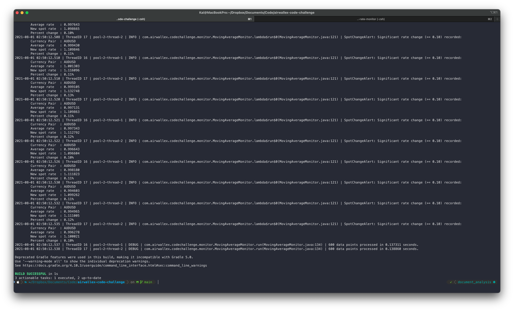

# Airwallex coding challenge

The aim of this exercise is to implement an "alerting" service which
will consume a file of currency conversion rates and
produce alerts.

The build system is configured to handle Java or Kotlin, which is our preferred language.
For the purpose of this coding exercise, you are allowed to choose a different programming language,
provided that you provide us with a detailed instruction on how to build and run your program.


### Input

The format of the file will simulate a stream of currency
conversion rates. Each line will be properly structured
JSON (http://jsonlines.org/):

    { "timestamp": 1554933784.023, "currencyPair": "CNYAUD", "rate": 0.39281 }

The fields in the JSON record are:
- timestamp: the timestamp of the record in seconds since UNIX epoch, 
  with fractional seconds specified
- currencyPair: the sell and buy currencies which the rate relates to
- rate: the conversion rate

You may assume that for each currency pair, currency conversion rates are streamed
at a constant rate of one per second. ie. for two consecutive "CNYAUD" entries in
in the input file, they will have timestamps that differ by one second:

    { "timestamp": 1554933784.023, "currencyPair": "CNYAUD", "rate": 0.39281 }
    { "timestamp": 1554933784.087, "currencyPair": "USDAUD", "rate": 0.85641 }
    { "timestamp": 1554933785.023, "currencyPair": "CNYAUD", "rate": 0.39295 }

### Output

The alerting service should produce the following alert as a JSON string output to
standard output:
- when the spot rate for a currency pair changes by more than 10% from the 5 minute average for that currency pair

The format of the alert produced should be:

    { "timestamp": 1554933784.023, "currencyPair": "CNYAUD", "alert": "spotChange" }

### Build and Execution

To build the application:
```bash
./gradlew clean build
```
To run the application:
```bash
./gradlew run --args example/input1.jsonl
```

### Submissions

Submissions will be assessed primarily on correctness but we will also be considering:
- code structure
- clean, readable code
- performance

You can submit your solution either as an archive file or as a link to a private cloud repository (such as Google Drive).
Please execute
```bash
./gradlew clean
```
to remove build artefacts prior to creating the archive file.

**Note:** We will not consider submissions that are uploaded to Github.

---

# Design and Justification

Smallest unit of task in the program is embodied by the Monitor abstract class, which requires implementation of `processRow()` and `run()`.

Justification
- A task in the context of log parsing will use a reader, and / or writer and optionally generate any alerts.
- For example, you may want a monitor to only act on certain type of data and insert the result to a database, but not need to print anything to the console.
- We can't know beforehand whether a task will generate logs, generate and act on alerts, or both. Whether and how each subclass of `Monitor` uses an alert or processes a row is up to the designer. The only requirement is to coordinate the execution under a single call to `.run()` method.

Key classes and objects
- `Monitor`: Abstract class for any unit of task. 
    - `MovingAverageMonitor`: Implements `Monitor` and extends `Runnable`. Encapsulation around `reader` and `writer` which will be used to generate `alert`.
- `Alert`: Alert that will be caught and printed by the logger. Requires `.toString()` method implementation.
    - `ExecutebleAlert`: Has the method `.execute()` which will be called automatically. For example, if an alert needs to be logged or written to a `.jsonline` file, insert that logic in  `.execute()` method.
        - `SpotChangeAlert`: Implementation of `ExecutableAlert`


